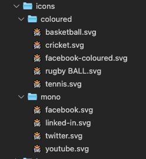

# Icon spritesheet with Laravel Mix

SVG icons can be served in multiple ways and one of them is utilising svg fragment identifiers. This sample uses Fragment identifier + CSS 3 combination. This means that there is no need to render SVG spritesheet at the top of the document and then use `<use></use>` tag. The following Sample assumes that spritesheet is kept under the same domain. Otherwise CORS policy will not allow this.

## Benefits
1. Tidy HTML
2. Caching benefits
3. No client side rendering delays or conversions
4. Automated system
5. Allows colour modifications case by case or on hover ( hardcoding svg would make it more difficult )
6. Separation of concerns ( SVG spritesheet is kept separate from main page HTML )
7. Unlikely to crash with caching plugins as icons are not modified ( w3 total caches as an example )
8. System will render svg even if javascript is disabled ( for systems that currently use JS to modify icons )

## Workflow
1. Gather icons from design
2. Add svg's in theme files separating **mono** from **coloured** (with meaningful names)
3. Laravel mix picks changes up and recreates svg spritesheets and CSS file
4. Use icons using class name


## Icons
There are very little prerequisites for icons. Icons should have a meaningful name as svg file name is used to form class name for the icon. icon names can contain spaces if needed, however Laravel Mix will slugify the file name when spritesheet is created.

For example :

```html
    my NICE icon WITH hoRRiBle name.svg
```

will become 

```html
    my-nice-icon-with-horrible-name.svg
```

Avoid using numbers as first characters of the svg name. Class Names with numbers are not supported in CSS.


### Icon folder structure
This is important as Laravel Mix will distingusih mono icons from coloured.
Why the separation?

Coloured icons are using `background-image` property to render icon. In contrast mono icons use `webkit-mask` and icon colour is then controlled as desired using `background` or `background-color` property.

Sample Structure:




### Icon sprites
There are to icon sprites:
1. `coloured-icon-sprite.svg`
2. `mono-icon-sprite.svg`

Icon sets are kept seperately, however, this can be combined if neeeded. Technically icons can have the same name when we think of `mono` and `coloured`, this is because each type if icon gets a postfix behind the scenes `-mono` and `-coloured` respectively. Whilst this example assumes same name icon for mono and coloured (facebook), it is advised to keep them separate. (facebook-mono or facebook-coloured as an example). 

Sample of mono spritesheet:

```html
<svg xmlns="http://www.w3.org/2000/svg" xmlns:xlink="http://www.w3.org/1999/xlink">
  <symbol style="enable-background:new 0 0 455 455" id="svg-facebook" viewBox="0 0 455 455">
    <title>facebook</title>
    <path style="fill-rule:evenodd;clip-rule:evenodd" d="M0 0v455h455V0H0zm301.004 125.217H265.44c-7.044 0-14.153 7.28-14.153 12.696v36.264h49.647c-1.999 27.807-6.103 53.235-6.103 53.235h-43.798V385h-65.266V227.395h-31.771v-53.029h31.771V131.01c0-7.928-1.606-61.009 66.872-61.009h48.366v55.216z" />
  </symbol>
  <use style="enable-background:new 0 0 455 455" xlink:href="#svg-facebook" width="455" height="455" />
  <view id="svg-facebook-mono" viewBox="0 0 455 455" />
</svg>
```

Sample of coloured spritesheet:

```html
<svg xmlns="http://www.w3.org/2000/svg" xmlns:xlink="http://www.w3.org/1999/xlink">
  <symbol style="enable-background:new 0 0 512 512" id="svg-basketball" viewBox="0 0 512 512">
    <title>basketball</title>
    <defs>
      <circle id="a" cx="256" cy="256" r="200" />
    </defs>
    <use xmlns:xlink="http://www.w3.org/1999/xlink" xlink:href="#a" style="overflow:visible;fill:#ff6d00" />
    <clipPath id="b">
      <use xmlns:xlink="http://www.w3.org/1999/xlink" xlink:href="#a" style="overflow:visible" />
    </clipPath>
    <g style="clip-path:url(#b)">
      <circle style="fill:none;stroke:#424242;stroke-width:8;stroke-miterlimit:10" cx="427.409" cy="256" r="132.087" />
      <circle style="fill:none;stroke:#424242;stroke-width:8;stroke-miterlimit:10" cx="85.409" cy="256" r="132.087" />
      <path style="fill:none;stroke:#424242;stroke-width:8;stroke-miterlimit:10" d="M256 61v390M64 256h385" />
    </g>
    <path style="fill:#424242" d="M256 70c49.683 0 96.391 19.347 131.522 54.478S442 206.317 442 256s-19.347 96.391-54.478 131.522S305.683 442 256 442s-96.391-19.347-131.522-54.478S70 305.683 70 256s19.347-96.391 54.478-131.522S206.317 70 256 70m0-14C145.543 56 56 145.543 56 256s89.543 200 200 200 200-89.543 200-200S366.457 56 256 56z" />
  </symbol>
  <use style="enable-background:new 0 0 512 512" xlink:href="#svg-basketball" width="512" height="512" />
  <view id="svg-basketball-coloured" viewBox="0 0 512 512" />
</svg>
```

## CSS

Laravel mix first creates two mixes for each type of icons, after this - both CSS files are combined into `icons.css` as due to their CSS properties, the y do not crash even with same icon names.

```css
*[class^="svg-"] {
    width: 2rem;
    height: 2rem;
    display: block;
    background-position: center center;
    background-repeat: no-repeat;
    background-size: contain;
    mask-repeat: no-repeat;
    -webkit-mask-repeat: no-repeat;
  }
  
  .svg-facebook {
    mask-image: url(/public/build/mono-icon-sprite.svg#svg-svg-facebook-mono);
    -webkit-mask-image: url(/public/build/mono-icon-sprite.svg#svg-facebook-mono);
  }
  
  .svg-linked-in {
    mask-image: url(/public/build/mono-icon-sprite.svg#svg-svg-linked-in-mono);
    -webkit-mask-image: url(/public/build/mono-icon-sprite.svg#svg-linked-in-mono);
  }

  .svg-cricket {
    background-image: url("/public/build/coloured-icon-sprite.svg#svg-cricket-coloured");
  }
  
  .svg-facebook {
    background-image: url("/public/build/coloured-icon-sprite.svg#svg-facebook-coloured");
  }
  ```

  Above is an example of a combined `icons.css`. Note that there are lines for the same icon `svg-facebook`. This is because we have facebook icon `coloured` and `mono`. Nothing breaks as styles are applied in a cascading style as one would expect.

## Usage

1. Add `icons.css` to the document
   
   ```html
       <link rel="stylesheet" href="/public/build/css/icons.css">
    ```

2. Reference icon using class name

```html
    <span class="svg-facebook"></span>
    <span class="svg-linked-in"></span>
    <span class="svg-twitter"></span>
    <span class="svg-youtube"></span>

    <span class="svg-basketball"></span>
    <span class="svg-cricket"></span>
    <span class="svg-rugby-ball"></span>
    <span class="svg-tennis"></span>
    <span class="svg-facebook"></span> 
```

Provided that URL's are correct and that the spritesheet is available - icons will render.

## Packages

1. [svg-spritemap-webpack-plugin](https://www.npmjs.com/package/svg-spritemap-webpack-plugin)
2. [fs-extra](https://www.npmjs.com/package/fs-extra)


### SVG Spritemap Webpack Plugin
Is used to create spritesheets as well as CSS stylesheets. Note that templates are modified within config to accommodate mono icons with `mask-image`

### FS extra
Used to delete separate CSS spritesheets once they are combined into one.


## DEMO